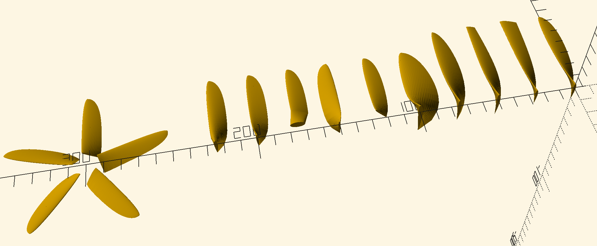

# bladegen

Generate propeller blades in OpenSCAD.



What can it do?

- Create propeller blades
- Use any four digit NACA profiles
- Specify size and pitch
- Specify elliptical lift outline or trapezoidal outlines
- Make propeller or turbine blades
- Finish the blade at the root
- The blades can rotate clockwise or counterclockwise
- You can specify the aspect ratio of the blade
- You can specify different wing profiles for each blade section, with
  interpolation
- You can plug in your own outline
- Specify accuracy for quick or precise output


Note the propellers and turbine blades generated by this code is not at all
tested in real life scenarios and may be totally wrong, though probably they
are ok.


## Installation

To use bladegen, you should put the `bladegen` folder from the git `libraries`
folder to the OpenSCAD library folder that you will find in the `File` menu of
OpenSCAD. Additionally you will need to install the DiscreteOpenSCAD library
[BOSL2](https://github.com/revarbat/BOSL2) also in the library folder.


## Usage

```openscad
use <bladegen/bladegen.scad>

INCH_MM = 25.6;


translate([0, 0, 0])   bladegen(pitch = 4 * INCH_MM, diameter = 5 * INCH_MM);
translate([0, 25, 0])  bladegen(pitch = 4 * INCH_MM, diameter = 5 * INCH_MM, outline = rectangular_outline());
translate([0, 50, 0])  bladegen(pitch = 4 * INCH_MM, diameter = 5 * INCH_MM, outline = rectangular_outline(taper_tip = 0.5));
translate([0, 75, 0])  bladegen(pitch = 4 * INCH_MM, diameter = 5 * INCH_MM, outline = elliptical_outline(exponent = 2));
translate([0, 100, 0]) bladegen(pitch = 40, diameter = 100, outline = elliptical_outline(aspect_ratio = 3));
translate([0, 125, 0]) bladegen(pitch = 40, diameter = 100, nodes = blade_nodes(inner_radius = 0.10));
translate([0, 150, 0]) bladegen(pitch = 40, diameter = 100, ccw = true);
translate([0, 175, 0]) bladegen(pitch = 40, diameter = 100, nodes = blade_nodes(inner_radius = 0.30), root = ellipse_root(radius = 0.1));
translate([0, 200, 0]) bladegen(pitch = 40, diameter = 100, turbine = true);
translate([0, 225, 0]) bladegen(pitch = 40, diameter = 100, wing_sections = [[0.0, 2440], [0.5, 2420], [1.0, 0010]]);
translate([0, 300, 0]) bladegen(pitch = 40, diameter = 100, nodes = blade_nodes(inner_radius = 0.15), blades = 5);
```

If you prefer, open the file `demo.scad` to run the above commands.

Lengths are given in the OpenSCAD unit which normally is mm. Some other values
are specified in % of blade length, 0.0 being at the root and 1.0 at the tip.
The root shape in particular should be scaled so that a width of 1.0 will be as
wide as the chord where the blade ends (`inner_radius`).

To make a hub, it must be done manually by a code something like


```openscad
use <bladegen/bladegen.scad>

diameter = 200;
hub_r = 15;
hub_h = 12;
hole_d = 6;

nodes = blade_nodes(inner_radius = 0.3);
root = ellipse_root(r = [0.2, 0.08], rotate = 40.0, radius = 0.10);

difference() {
  union() {
    bladegen(diameter = 200, pitch = 150, nodes = nodes, root = root, blades = 5);
    translate([0, 0, -1]) cylinder(r = hub_r, h = hub_h, center = true);
  }
  cyl(d = hole_d, h = 99, center = true, $fn = 30);
}
```

This code also demontrates ending the blade near the root, though being quite
flaky to achieve.


## Computational model

The library is built around the `bladegen` function. All parameters are
supplied with default values, but you may want to change these.

The `nodes` argument says at which radii (distance 0.0 at root, 1.0 at tip)
where a profile should be inserted. Normally you would create the `nodes` data
structure by calling `nodes = blade_nodes(...)`. It accepts the parameters `n`
for number of points to calculate, and `inner_radius` to skip generating the
blade closest to the rotational center.

The outline is calculated as a chord length at each node point. You would
normally generate an outline with the function `elliptical_outline(...)` or
`rectangular_outline(...)`. If you don't use the default nodes, you must
supplie your custom nodes to the function call using the `nodes = ...`
parameter.

The wing section profile is done much the same as the outline calculation, but
to make things more conventient, profiles are interpolated along the blade
length. So either you can just supply a NACA 4 digit number to the
`wing_sections` argument to just use one wing section profile, or you can
supply a list of pairs containing radius and NACA 2 digit code as many as you
need. The `bladegen` function will calulate interpolated profiles for each node
point.

